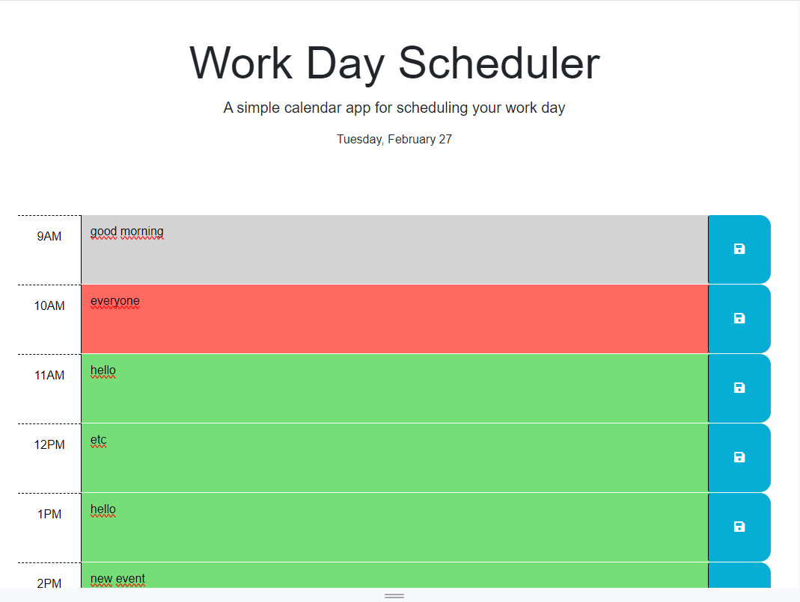

# bilbatua-scheduler-4675

the purpose of this application is to make a functional work day scheduler, so people will be able to see how their tasks are scheduled and organized in this web application.

# Description
This is a web application that only employers can use when working from 9 to 5pm when they are working for their company. Employers and even
employees could have the ability to store the task they do daily during working times

# Installation

N/A

# Usage

this is only used on web browsers and there is not the option to download the software from any particular website or appstore 
for smartphones or tablets; we can only access it using a browser

# Screenshot

here is the screenshot:

# Links

here are the links of the deployed application and repository:

()
()

# Credits

N/A

# License

(https://github.com/Paul449/bilbatua-scheduler-4675/blob/main/LICENSE)